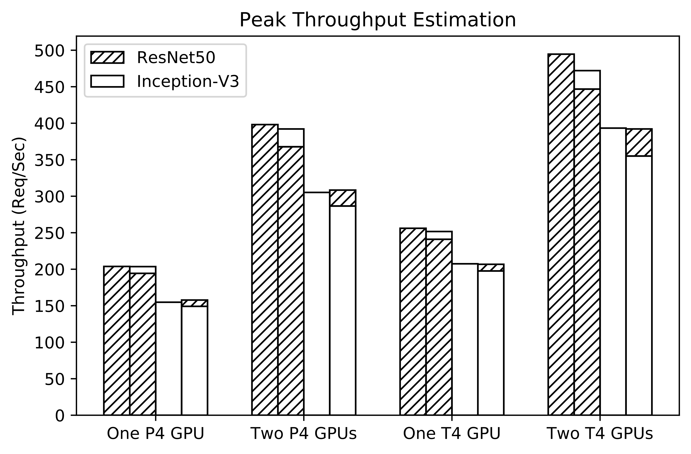
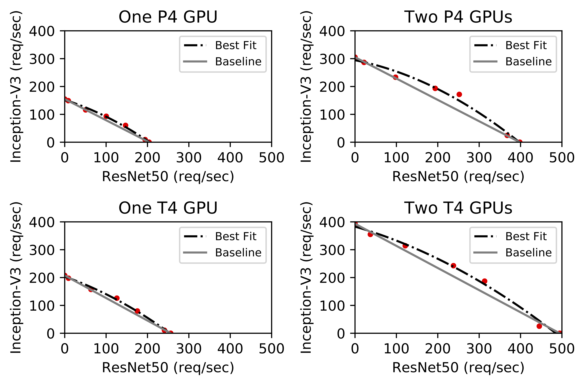

# PERSEUS: Characterizing Performance and Cost of Multi-Tenant Serving for CNN Models

## About

This repo is for the short paper [PERSEUS: Characterizing Performance and Cost of Multi-Tenant Serving for CNN Models](https://arxiv.org/abs/1912.02322) in proceedings of IC2E 2020. 

In this paper, we looked at the problem of efficiency and cost saving deep learning inference in the cloud environment. More concretely, we tackled the problem using multi-tenant model serving -- instead of having GPU servers hosting one model dedicately, we serve multiple models on individual GPU servers, subject to the GPU memory capacity. In doing so, we improved the utilization of hardware resources, especially GPU. To achieve this task, we built a measurement framework PERSEUS to characterize and measure the performence and cost trade-offs doing multi-tenant model serving. 

#### Highlight

- We evaluated multi-tenant model serving using PERSEUS on several metrics such as inference throughput, monetary cost, and GPU utilization. We showed that multi-tenant serving can lead to up to 12% cost reduction, while maintaining the SLA requirement of model serving.

- We identified several potential improvements from the deep learning framework's perspective, to provide better support for serving models, especially on CPUs.

**Fig 1. Throughput comparison measured of dedicated serving vs. multi-tenant serving.**

**Fig 2. Monetary saving with multi-tenant serving.**

## How to use the code

In construction.

## Citation

If you would like to cite the paper, please cite it as:

## Acknowledgement

We would like to thank National Science Foundation grants #1755659 and #1815619, and Google Cloud Platform Research credits.

## Contact

More project information can be found in our lab's [project site](https://cake-lab.github.io/projects/). 

- Mattew LeMay [mlemay@wpi.edu](mlemay@wpi.edu)

- Shijian Li [sli8@wpi.edu](sli8@wpi.edu)

- Tian Guo [tian@wpi.edu](tian@wpi.edu)